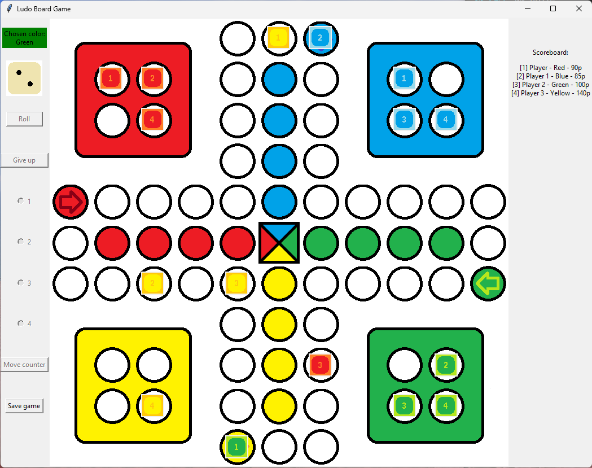

# Ludo Game in Python

This game features a interface created using the `tkinter` and `pillow` libraries, along with `SQLite3` for data storage. The game offers an extensive menu allowing players to switch between English and Polish languages. It supports up to 4 players, who can be either human or virtual opponents.

## Features:
- Graphical user interface built with `tkinter` and `pillow`.
- Language switch functionality (English/Polish) in the menu.
- Multiplayer support for up to 4 players (human or virtual).
- Surrender option available at any point during the game.
- Scoring system: 20 points for capturing an opponent's piece, and -15 points for the captured opponent.
- Points awarded at the end of the game: 100 for the first, 80 for the second, 60 for the third, and 50 for the fourth player.
- Global leaderboard recording points from all games for each player.
- Save and resume functionality for ongoing games.

## Gameplay:
- Each player earns points for capturing opponent pieces.
- The game ends when a player reaches the destination with their pieces.
- Points are awarded based on the order of completion.

## Scoreboard:
- All points from every game are accumulated in the global leaderboard.
- Players can strive to increase their global score through multiple sessions.

## Surrender and Save:
- Players have the option to surrender at any point during the game.
- Save functionality allows players to interrupt a game and resume it later.

